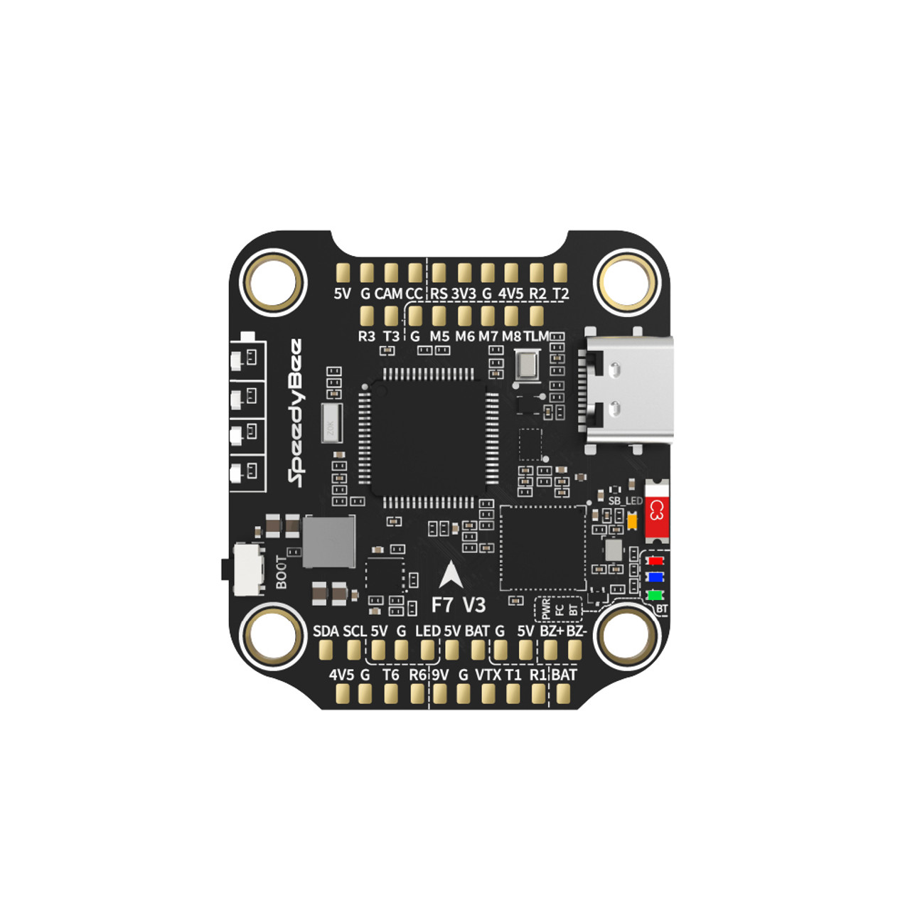

.. _speedybee_f7v3:

SpeedyBee F7V3
###################

Overview
********

TODO

Hardware
********

- TODO

For more information about the SpeedyBee F7V3, see:

- `SpeedyBee F7V3 Website`_
- `SpeedBee F7V3 Manual`_

Connections and IOs
===================

TODO

+---------+-----------------+----------------------------+
| Name    | Function        | Usage                      |
+=========+=================+============================+
| PIO0_17 | GPIO            | USR SW3                    |
+---------+-----------------+----------------------------+
| TODO    |                 |                            |
+---------+-----------------+----------------------------+

Programming and Debugging
*************************

TODO

Flashing
========

TODO

Debugging
=========

TODO

.. _SpeedyBee F7V3 Website:
   https://www.speedybee.com/speedybee-f7-v3-flight-controller/

.. _SpeedBee F7V3 Manual:
   https://www.speedybee.com/speedybee-f7-v3-flight-controller/#Manual
